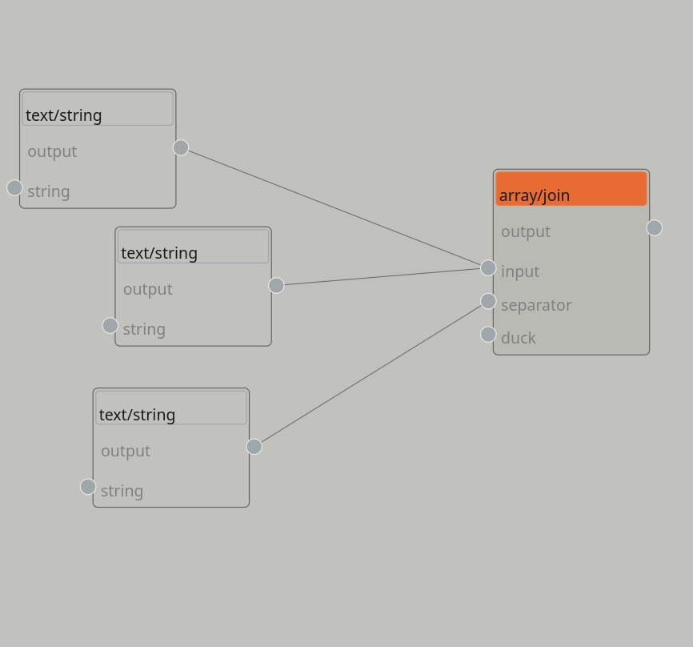
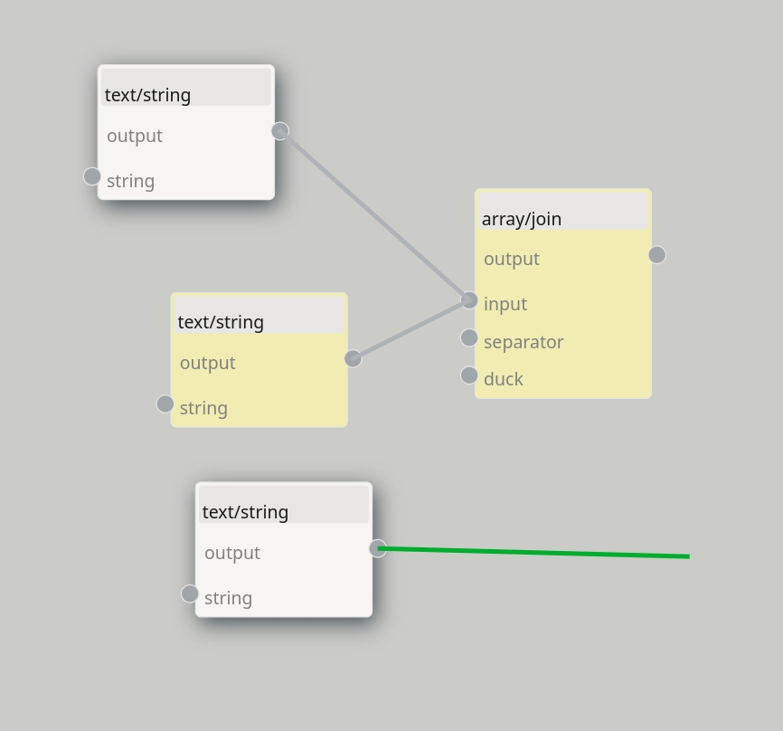
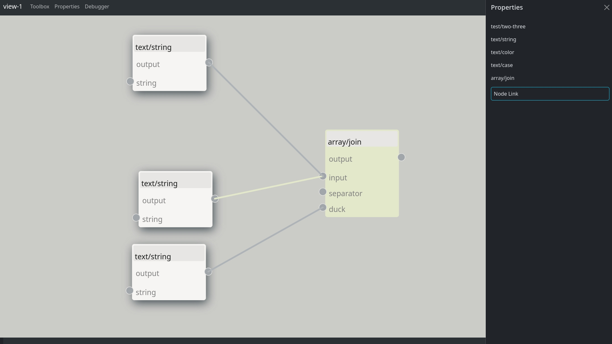
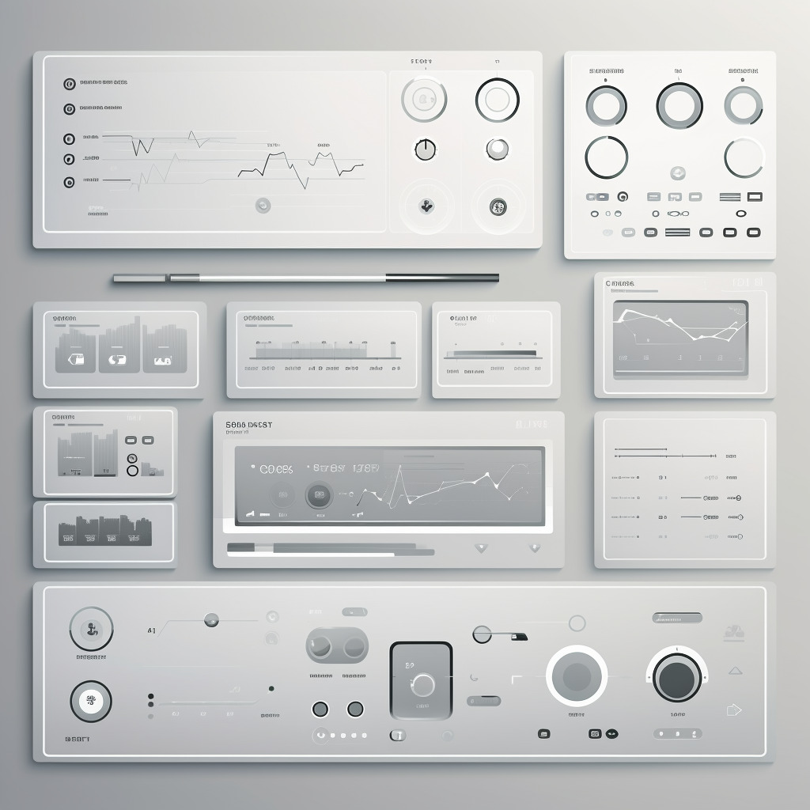

# signalcraft
A tiny visual programming language.

## Usage

CTRL+Click on caption or cable will select it.

## TODO

### Bug Fix

- No bugs atm

### Urgent!

- Instead of centering nodes on add (which calls for rendering and measuring, and thus EventEmitter) allow drag and drop from the toolbox, allowing user to pick the position
- Add File > Save
- Add File > Load
- Finish Toolbox
- Add Property Pane
- Live Data Output Bottom Debugger
- Add minimal previews to nodes (string, number color, etc...)
- Drag Connecting lines between entire Line.js not just Port, it is easier to hit the target
- default action for drag should be selection manager not panning, see NodeRED
- Prefer Api usage over manually interacting with collections: search for [A-Z][a-z]+\.create and replace with API methods


### Main
- When deleting a Junction between two other junction reconnect them, investigate reconnecting of nodes as well
- Cable Type Sensitivity - Should be type sensitive numbers, strings, objects.
- Input/Output Line where both I/O ports visually align for neat programs (Line.js)
- ForeignObjects in ZUI Mode
- Give TODOM multiple code generation profiles
- Node Property Editor (YAML First)
- Add A Game Like Tutorial with Achievement unlocked

### Unsure

- LOD: on scale 2+ show string preview in Line via FOreignObject
- Add Node Selection Manager (maybe groups, maybe lasso select with boolean math)
- Add Node Search And Canvas Scroll
- consider bounds padding to become a [0, 3, [0], [3]] with top right, bottom left like in CSS
- too hard to click on caption, at certain scale make the entire node draggable?
- Drag Cable at any point to take over XY of destination?
- Node Alignment, Aligh Tops of Nodes (via shortcut key)

## How It Works

- you define node types first
- then create a view, which is a UI, an SVG
- then you addNode(type) the view will update to show that node
- then you linkNodes to create a flow (see src/usage.js)
- then you .run(node), you have to specify a node you want to spider up and execute payload on

## How It Really Works

- System Is Reactive, Full Time Travel
- When defining Types, you really just specify Input Dots and Reply Dots.
- Input is the Property of a Node that you can link to
- Reply is the Function of a Node that gets executed via a downstream node
- Nodes are decorated as Panels
- Edges are decorated as Cables
- Reactivity Links everything together.

### Current State





### Design Ideas




### Notes

```JavaScript
// centering a node, it requires an even emitter trigerring "rendered" and then measuring width and height of the rendered node
// using the calculation below as base, but then setting CX/XY (centerX, centerY) by substracting half with/height from below
// this means that cx/cy calls for use of event emitter, good idea but too early in development atm.
x:  (0-this.view.transform.x+((this.view.svg.getBoundingClientRect().width/2)))/this.view.transform.scale,
y:  (0-this.view.transform.y+((this.view.svg.getBoundingClientRect().width/2)))/this.view.transform.scale
```
