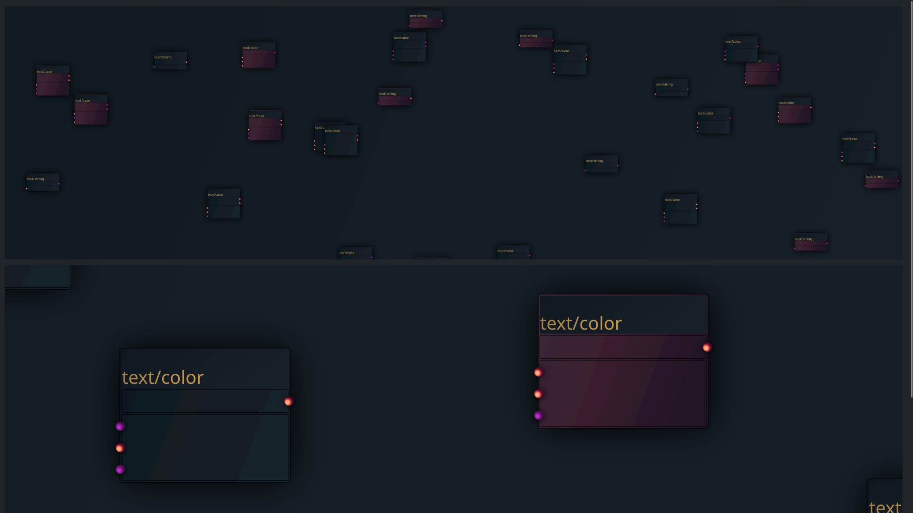

# signalcraft
A tiny visual programming language.

## Building
npm install --save-exact --save-dev esbuild

## TODO

- implement cables/wires
- cables should be type sensitive numbers, strings, objects
- Paint edges
- Add Drag & Drop
- Add Selection Manager (maybe groups)

### Design Ideas

-1.jpg](fui-1.jpg)

### Current State

